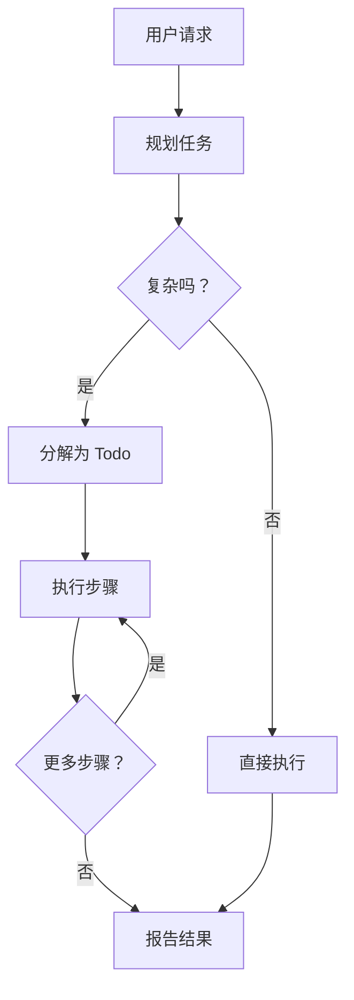

# 核心概念

pydantic-deep 提供了一个包含四大支柱的深度智能体框架：

<div class="feature-grid">
<div class="feature-card">
<h3>🤖 Agent (智能体)</h3>
<p>由 LLM 驱动的自主 Agent，能够规划、执行和迭代。</p>
<a href="agents/">了解 Agent →</a>
</div>

<div class="feature-card">
<h3>💾 后端 (Backends)</h3>
<p>可插拔的文件存储 - 内存、文件系统或 Docker。</p>
<a href="backends/">了解后端 →</a>
</div>

<div class="feature-card">
<h3>🔧 工具集 (Toolsets)</h3>
<p>扩展 Agent 能力的工具集合。</p>
<a href="toolsets/">了解工具集 →</a>
</div>

<div class="feature-card">
<h3>🎯 技能 (Skills)</h3>
<p>按需加载指令的模块化包。</p>
<a href="skills/">了解技能 →</a>
</div>
</div>

## 架构概览

```
┌─────────────────────────────────────────────────────────────────┐
│                        create_deep_agent()                       │
├─────────────────────────────────────────────────────────────────┤
│                                                                  │
│  ┌──────────────┐  ┌──────────────┐  ┌──────────────┐           │
│  │ TodoToolset  │  │  Filesystem  │  │  SubAgent    │           │
│  │              │  │   Toolset    │  │   Toolset    │           │
│  │ write_todos  │  │ ls, read,    │  │    task      │           │
│  │              │  │ write, edit  │  │              │           │
│  └──────────────┘  └──────────────┘  └──────────────┘           │
│                                                                  │
│  ┌──────────────┐                                               │
│  │   Skills     │                                               │
│  │   Toolset    │                                               │
│  │ list_skills  │                                               │
│  │ load_skill   │                                               │
│  └──────────────┘                                               │
│                                                                  │
├─────────────────────────────────────────────────────────────────┤
│                       DeepAgentDeps                              │
│  ┌──────────────┐  ┌──────────────┐  ┌──────────────┐           │
│  │   Backend    │  │    Todos     │  │  Subagents   │           │
│  │  (storage)   │  │   (list)     │  │   (dict)     │           │
│  └──────────────┘  └──────────────┘  └──────────────┘           │
│                                                                  │
└─────────────────────────────────────────────────────────────────┘
```

## Deep Agent 模式

一个 "deep agent" 是一个能够执行以下操作的自主 Agent：

1. **规划** - 将复杂任务分解为更小的步骤
2. **执行** - 使用工具执行动作
3. **迭代** - 检查结果并调整方法
4. **委托** - 生成子智能体进行专业工作

### 示例流程



## 快速参考

### 创建 Agent

```python
from pydantic_deep import create_deep_agent

agent = create_deep_agent(
    model="openai:gpt-4.1",  # 使用的 LLM
    instructions="You are a coding assistant.",   # 系统提示词
    include_todo=True,                            # 规划工具
    include_filesystem=True,                      # 文件操作
    include_subagents=True,                       # 任务委托
    include_skills=True,                          # 技能包
)
```

### 创建依赖项

```python
from pydantic_deep import DeepAgentDeps, StateBackend

deps = DeepAgentDeps(
    backend=StateBackend(),  # 文件存储
    todos=[],                # 任务列表
    subagents={},            # 预配置的 Agent
)
```

### 运行 Agent

```python
result = await agent.run(
    "Create a Python module with utility functions",
    deps=deps,
)

print(result.output)  # Agent 的响应
```

## 关键设计原则

### 1. Pydantic AI 原生

完全基于 Pydantic AI 构建，利用：

- 类型安全的 Agent 和工具
- 用于依赖注入的 RunContext
- 结构化输出支持
- 模型无关的设计

### 2. 基于协议的后端

存储通过协议进行抽象：

```python
from typing import Protocol

class BackendProtocol(Protocol):
    def read(self, path: str) -> str: ...
    def write(self, path: str, content: str) -> WriteResult: ...
    # ... 更多方法
```

这允许轻松扩展新的存储后端。

### 3. 渐进式披露

技能使用渐进式披露来优化 Token 使用：

- **发现**：仅元数据（名称、描述、标签）
- **加载**：按需加载完整指令
- **资源**：需要时可访问的额外文件

### 4. 上下文隔离

子智能体在隔离的上下文中运行：

- 新鲜的 todo 列表
- 无嵌套子智能体委托
- 共享文件存储（通过引用）

这防止了上下文膨胀和无限递归。

## 下一步

- [Agent](agents.md) - 深入研究 Agent 创建
- [后端](backends.md) - 了解存储选项
- [工具集](toolsets.md) - 可用工具和自定义
- [技能](skills.md) - 创建和使用技能
